# Online Quiz Platform — System Architecture

> **Status:** Active development  
> **Architecture:** Online-only, real-time quiz platform  
> **Core stack:** Cloudflare Workers, Durable Objects, WebSockets, Hyperdrive, PostgreSQL

## Table of Contents

1. [Project Overview](#1-project-overview)
2. [Project Goals](#2-project-goals)
3. [Technology Stack](#3-technology-stack)
4. [Level 1 — Client Architecture](#4-level-1--client-architecture)
5. [Level 2 — Network and Cloudflare Edge](#5-level-2--network-and-cloudflare-edge)
6. [Level 3 — Worker Backend](#6-level-3--worker-backend)
7. [Level 4 — Real-Time Quiz Architecture](#7-level-4--real-time-quiz-architecture)
8. [Level 5 — Data Architecture](#8-level-5--data-architecture)
9. [Level 6 — Quiz Flow](#9-level-6--quiz-flow)
10. [Level 7 — Admin Architecture](#10-level-7--admin-architecture)
11. [Level 8 — Security Architecture](#11-level-8--security-architecture)
12. [Level 9 — Deployment Architecture](#12-level-9--deployment-architecture)
13. [Level 10 — Full System Architecture](#13-level-10--full-system-architecture)
14. [Repository Structure](#14-repository-structure)
15. [Quiz State Machine](#15-quiz-state-machine)
16. [Database Design](#16-database-design)
17. [Failure Handling](#17-failure-handling)
18. [Resolved Architecture Flaws](#18-resolved-architecture-flaws)
19. [Development Roadmap](#19-development-roadmap)
20. [Final Architecture Rule](#20-final-architecture-rule)

---

## 1. Project Overview

The Online Quiz Platform is an **online real-time quiz system** for campus events, competitions, workshops, and assessments.

The architecture has three major runtime responsibilities:

- **Cloudflare Worker:** API routing, authentication, validation, and application logic.
- **Durable Object:** live state and real-time coordination for an active quiz session.
- **PostgreSQL:** persistent users, quizzes, questions, answers, scores, and results.

### 1.1 High-Level Flow

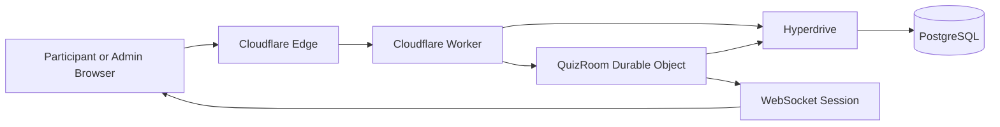

---

## 2. Project Goals

### Primary goals

1. Online participant login.
2. Online quiz joining.
3. Fixed-capacity admission.
4. Waiting queue when capacity is full.
5. Real-time questions and timer.
6. Server-authoritative answer validation.
7. Server-authoritative scoring.
8. Real-time leaderboard updates.
9. Persistent final results.
10. Admin control and live monitoring.
11. Reconnection support.
12. Duplicate-answer protection.

### Core user journey

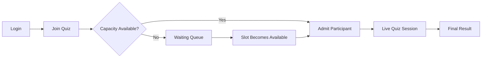

---

## 3. Technology Stack

| Layer | Technology | Purpose |
| :--- | :--- | :--- |
| Client | React / TypeScript / PWA | Participant and admin interfaces |
| Edge | Cloudflare DNS / TLS | Traffic entry |
| Backend | Cloudflare Workers | APIs and application logic |
| Real-time | Durable Objects | Per-quiz coordination |
| Transport | WebSockets | Real-time communication |
| DO Storage | SQLite-backed Durable Object storage | Durable live-session state |
| Database | PostgreSQL | Persistent application data |
| DB Connectivity | Hyperdrive | Worker to PostgreSQL connectivity |
| Deployment | Wrangler + GitHub Actions | Build and deployment |

---

# 4. Level 1 — Client Architecture

## 4.1 Participant Architecture

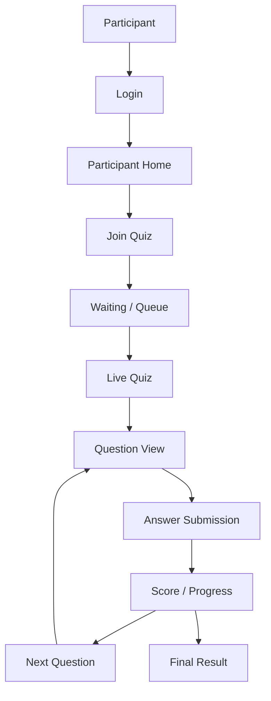

## 4.2 Admin Architecture

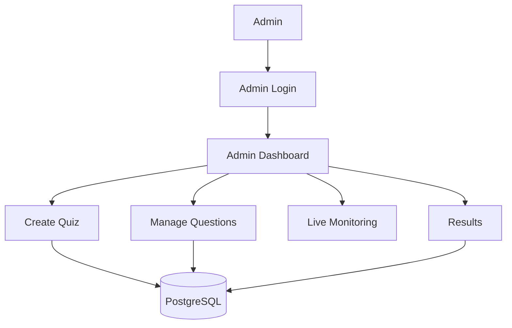

---

# 5. Level 2 — Network and Cloudflare Edge

## 5.1 Request Path

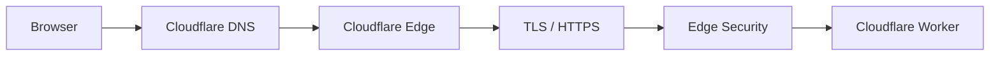

## 5.2 Edge Responsibilities

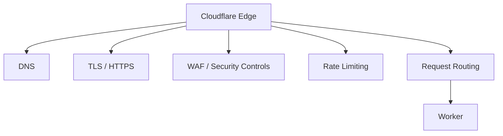

---

# 6. Level 3 — Worker Backend

## 6.1 Worker Architecture

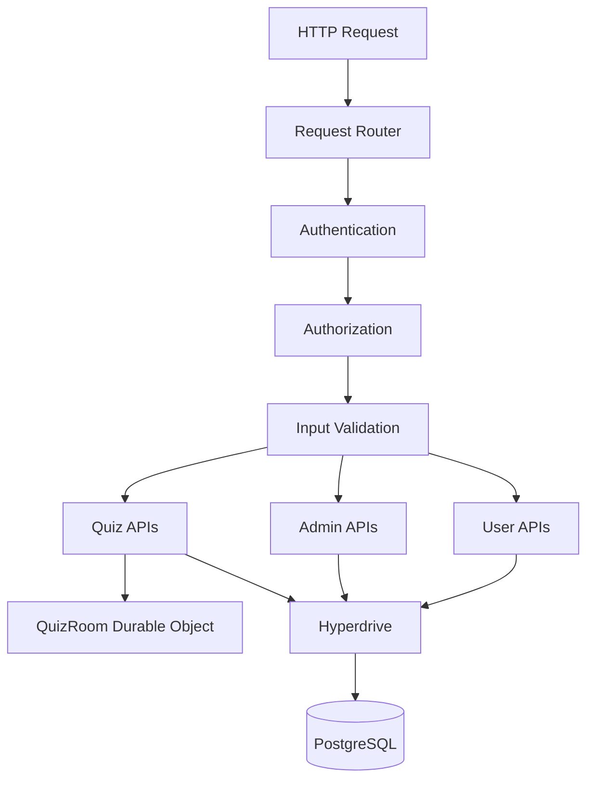

## 6.2 Example Join Request

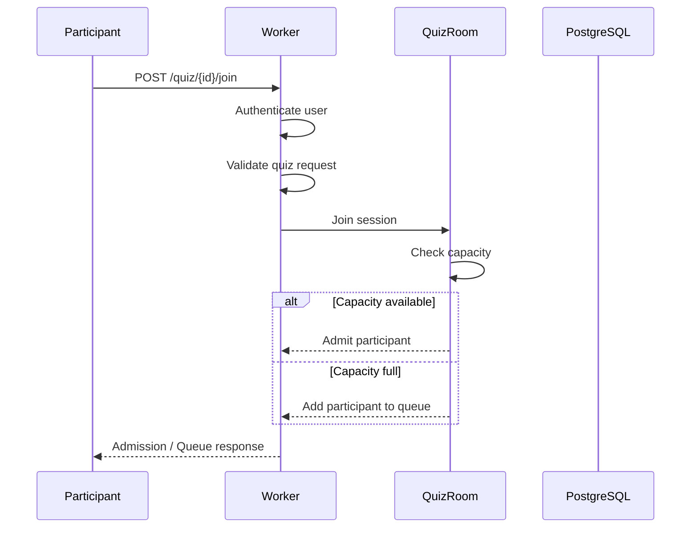

---

# 7. Level 4 — Real-Time Quiz Architecture

## 7.1 Durable Object as QuizRoom

Each active quiz session is represented by a Durable Object instance.

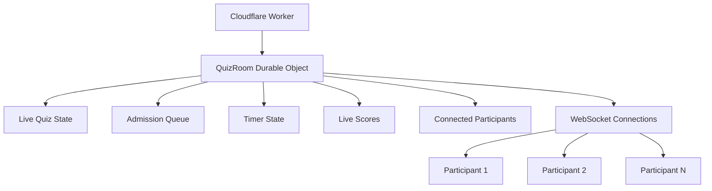

## 7.2 Question Cycle

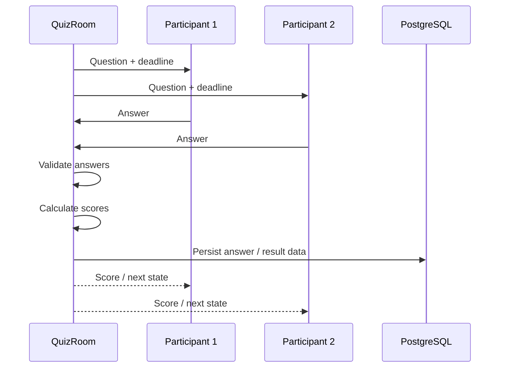

## 7.3 Real-Time Responsibilities

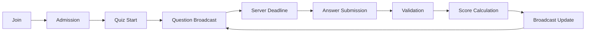

---

# 8. Level 5 — Data Architecture

## 8.1 Data Ownership

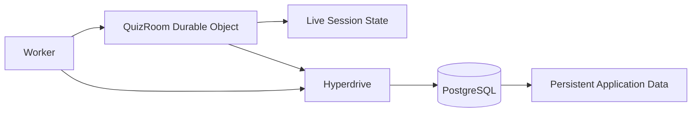

### Durable Object live state

- Connected participants
- Queue
- Current question
- Current question deadline
- Active session state
- Temporary answer state
- Live score state
- WebSocket session state

### PostgreSQL persistent state

- Users
- Roles
- Quizzes
- Questions
- Options
- Answer records
- Scores
- Final results
- Audit events

## 8.2 Data Ownership Rule

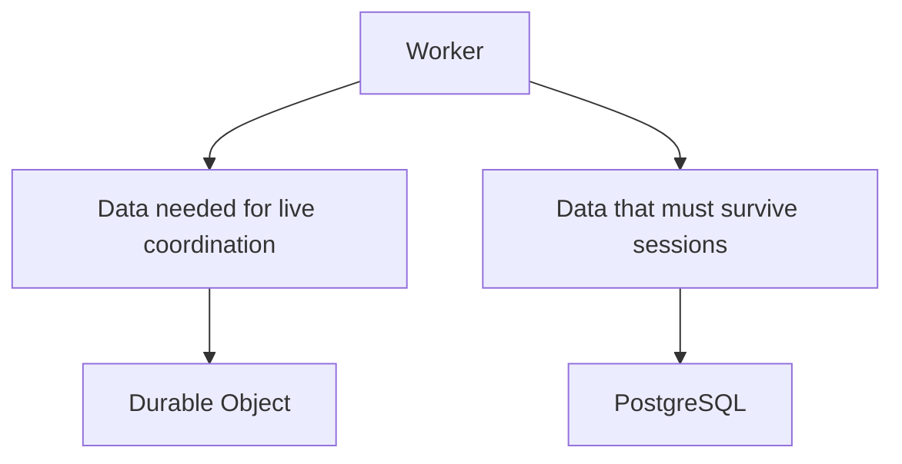

---

# 9. Level 6 — Quiz Flow

## 9.1 Complete Participant Flow

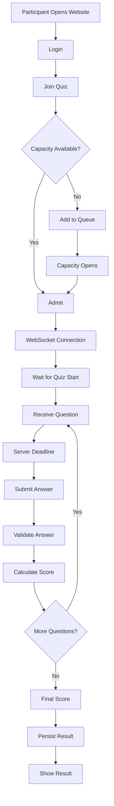

## 9.2 Queue Flow

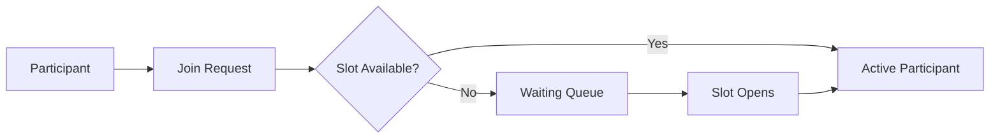

---

# 10. Level 7 — Admin Architecture

## 10.1 Admin Control Flow

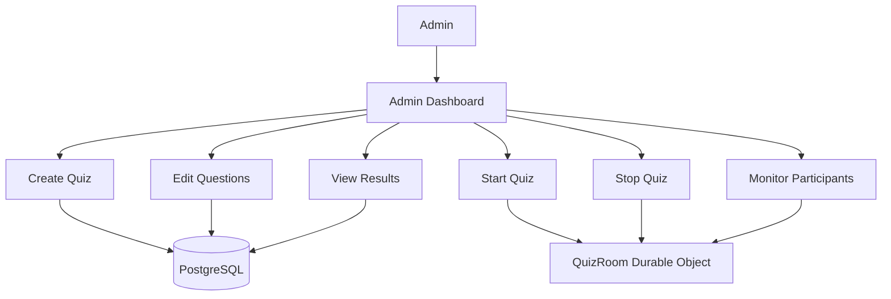

## 10.2 Admin and Participant Separation

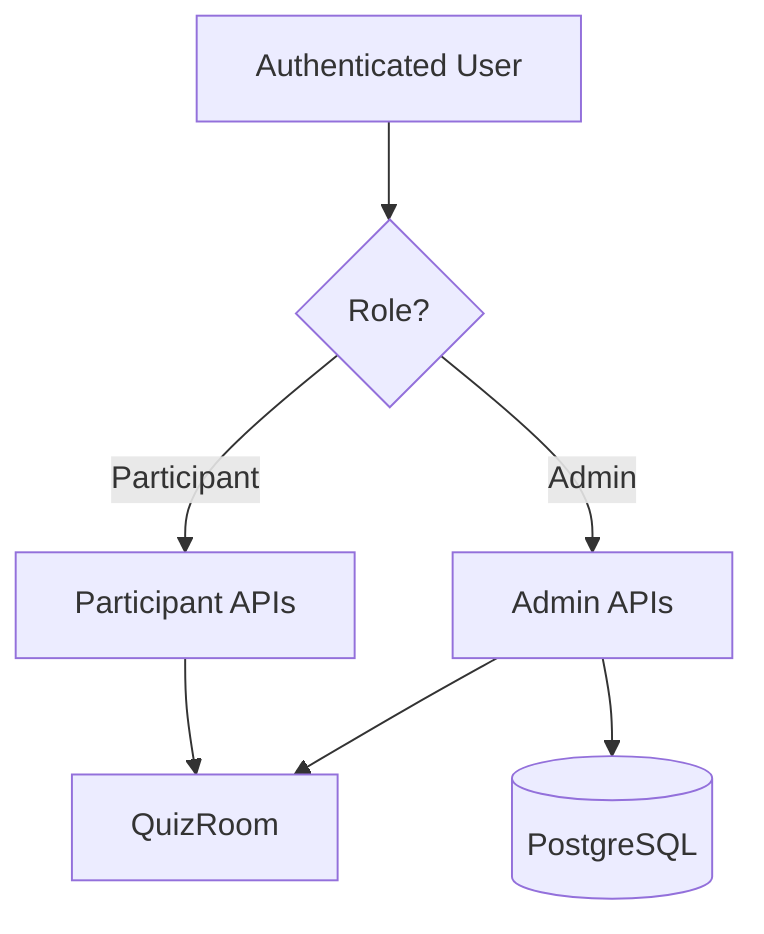

---

# 11. Level 8 — Security Architecture

## 11.1 Security Flow

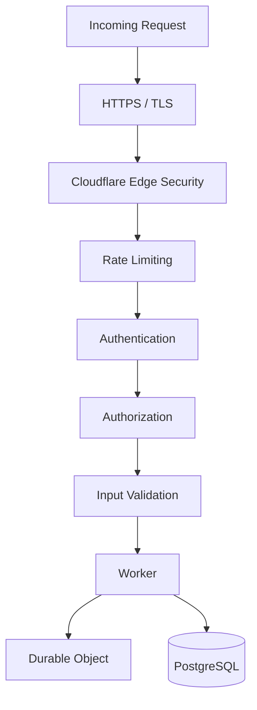

## 11.2 Security Boundaries

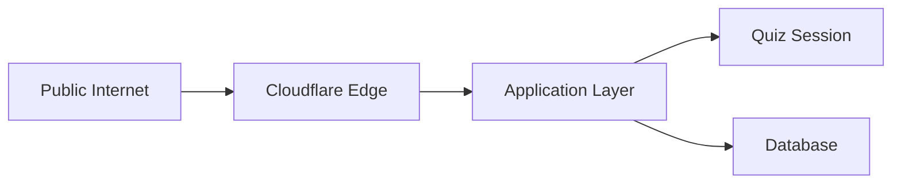

### Security rules

- HTTPS only.
- Authenticate every protected action.
- Check participant/admin role before privileged actions.
- Never trust client-side scores.
- Never trust client-side timer values.
- Validate every submitted answer against server state.
- Apply rate limits to authentication and answer endpoints.
- Do not expose database credentials to clients.
- Do not send secret values to participant browsers.

---

# 12. Level 9 — Deployment Architecture

## 12.1 Production Deployment

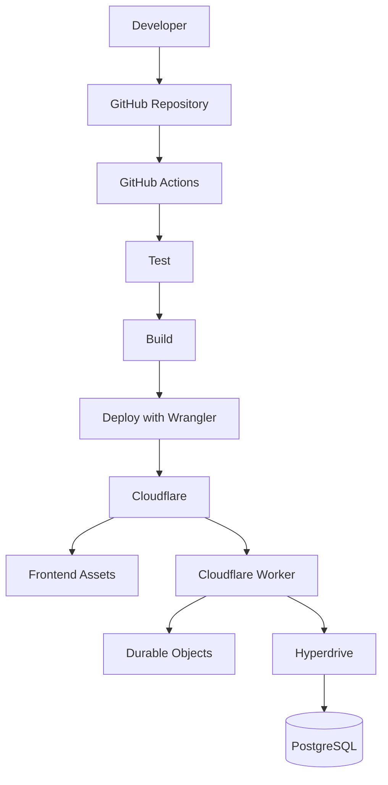

## 12.2 Deployment Responsibilities

```mermaid
flowchart LR
    FRONT[Frontend] --> CF[Cloudflare]
    BACKEND[Worker Backend] --> CF
    SESSION[Durable Object] --> CF
    DATABASE[PostgreSQL] --> DBHOST[Managed PostgreSQL Provider]
    CF --> HD3[Hyperdrive]
    HD3 --> DATABASE
```

## 12.3 CI/CD Flow

```mermaid
flowchart LR
    PUSH[Git Push] --> ACTIONS[GitHub Actions]
    ACTIONS --> LINT[Lint]
    LINT --> TESTS[Tests]
    TESTS --> BUILD2[Build]
    BUILD2 --> DEPLOY2[Wrangler Deploy]
    DEPLOY2 --> PRODUCTION[Production]
```

---

# 13. Level 10 — Full System Architecture

```mermaid
flowchart TD
    P[Participant Browser] --> EDGE3[Cloudflare Edge]
    A[Admin Browser] --> EDGE3

    EDGE3 --> W5[Cloudflare Worker]

    W5 --> AUTH3[Authentication]
    W5 --> API3[API Router]
    W5 --> D6[QuizRoom Durable Object]
    W5 --> H6[Hyperdrive]

    AUTH3 --> API3
    API3 --> D6
    API3 --> H6

    D6 --> SOCKET[WebSocket]
    SOCKET --> P

    D6 --> H6
    H6 --> DB6[(PostgreSQL)]

    D6 --> LIVE2[Queue]
    D6 --> LIVE3[Timer]
    D6 --> LIVE4[Question State]
    D6 --> LIVE5[Live Scores]

    DB6 --> USERS[Users]
    DB6 --> QUIZZES[Quizzes]
    DB6 --> QUESTIONS[Questions]
    DB6 --> ANSWERS[Answers]
    DB6 --> RESULTS[Results]
```

## 13.1 Full Runtime Flow

```mermaid
sequenceDiagram
    participant P as Participant
    participant E as Cloudflare Edge
    participant W as Worker
    participant D as QuizRoom
    participant H as Hyperdrive
    participant DB as PostgreSQL

    P->>E: HTTPS request
    E->>W: Forward request
    W->>W: Authenticate and validate
    W->>D: Join quiz session
    D->>D: Check capacity

    alt Slot available
        D-->>W: Admit
    else Queue required
        D-->>W: Queue participant
    end

    W-->>P: Session state
    P->>D: WebSocket connection
    D-->>P: Question + deadline
    P->>D: Answer
    D->>D: Validate + score
    D->>H: Persist required data
    H->>DB: PostgreSQL operation
    DB-->>H: Result
    H-->>D: Persist complete
    D-->>P: Score / next state
```

---

# 14. Repository Structure

```text
quiz-platform/
├── frontend/
│   ├── participant/
│   ├── admin/
│   └── shared/
│
├── worker/
│   ├── src/
│   │   ├── index.ts
│   │   ├── routes/
│   │   ├── auth/
│   │   ├── services/
│   │   └── lib/
│   └── wrangler.jsonc
│
├── durable-objects/
│   └── QuizRoom.ts
│
├── database/
│   ├── schema.sql
│   └── migrations/
│
├── tests/
│   ├── unit/
│   ├── integration/
│   └── load/
│
├── .github/
│   └── workflows/
│       └── deploy.yml
│
├── README.md
└── ARCHITECTURE.md
```

---

# 15. Quiz State Machine

```mermaid
stateDiagram-v2
    [*] --> DRAFT
    DRAFT --> OPEN
    OPEN --> RUNNING
    RUNNING --> PAUSED
    PAUSED --> RUNNING
    RUNNING --> COMPLETED
    OPEN --> CLOSED
    RUNNING --> CLOSED
    COMPLETED --> [*]
    CLOSED --> [*]
```

### State meaning

| State | Meaning |
| :--- | :--- |
| `DRAFT` | Quiz is being configured |
| `OPEN` | Quiz can accept participants |
| `RUNNING` | Questions are actively being delivered |
| `PAUSED` | Quiz temporarily paused by admin |
| `COMPLETED` | Quiz finished normally |
| `CLOSED` | Quiz closed or cancelled |

---

# 16. Database Design

## 16.1 ER Diagram

```mermaid
erDiagram
    USER ||--o{ QUIZ : creates
    QUIZ ||--o{ QUESTION : contains
    QUESTION ||--o{ OPTION : has
    QUIZ ||--o{ PARTICIPATION : has
    USER ||--o{ PARTICIPATION : joins
    QUESTION ||--o{ ANSWER : receives
    USER ||--o{ ANSWER : submits
    QUIZ ||--o{ RESULT : produces
    USER ||--o{ RESULT : receives

    USER {
        uuid id PK
        string name
        string email
        string role
        datetime created_at
    }

    QUIZ {
        uuid id PK
        uuid creator_id FK
        string title
        int capacity
        int duration_seconds
        string status
        datetime created_at
    }

    QUESTION {
        uuid id PK
        uuid quiz_id FK
        string text
        int position
        int points
    }

    OPTION {
        uuid id PK
        uuid question_id FK
        string text
        boolean is_correct
    }

    PARTICIPATION {
        uuid id PK
        uuid quiz_id FK
        uuid user_id FK
        string status
        int final_score
        datetime joined_at
    }

    ANSWER {
        uuid id PK
        uuid question_id FK
        uuid user_id FK
        uuid option_id FK
        boolean is_correct
        int points_awarded
        datetime submitted_at
    }

    RESULT {
        uuid id PK
        uuid quiz_id FK
        uuid user_id FK
        int score
        int rank
        datetime created_at
    }
```

---

# 17. Failure Handling

## 17.1 Reconnection Flow

```mermaid
flowchart TD
    USER2[Participant Connected] --> DROP[Connection Lost]
    DROP --> RECONNECT[Reconnect]
    RECONNECT --> SESSIONLOOKUP[Lookup Quiz Session]
    SESSIONLOOKUP --> STATECHECK{Session Still Active?}
    STATECHECK -->|Yes| RESTORE[Restore Participant State]
    STATECHECK -->|No| ENDED[Show Quiz Ended]
    RESTORE --> CONTINUE[Continue Quiz]
```

## 17.2 Durable Object Restart / Eviction

The system must not rely only on JavaScript memory for important state.

```mermaid
flowchart LR
    MEMORY[In-memory Live State] --> DO_STORAGE[Durable Object Storage]
    DO_STORAGE --> RESTORE[State Restoration]
    RESTORE --> SESSION2[Continue Session]
    SESSION2 --> DB7[(PostgreSQL)]
```

## 17.3 Database Failure

```mermaid
flowchart TD
    WRITE[Persist Result] --> DBFAIL{Database Available?}
    DBFAIL -->|Yes| SUCCESS[Persisted]
    DBFAIL -->|No| RETRY[Controlled Retry]
    RETRY --> DBFAIL
    RETRY -->|Retry Limit Exceeded| ERROR[Record Failure / Alert]
```

---

# 18. Resolved Architecture Flaws

| Previous concern | Final solution |
| :--- | :--- |
| Offline-first direction | Removed; platform is online-only |
| Separate Socket.IO server | Removed; Durable Object owns the live session |
| Redis required from day one | Removed from the core architecture; add only after measured need |
| Timer controlled by client | Server / Durable Object controls the authoritative deadline |
| Score trusted from browser | Score calculated on server |
| Queue handled by frontend | Queue handled by QuizRoom |
| Live state stored only in frontend | Live state owned by Durable Object |
| Persistent data stored only in live state | PostgreSQL is the permanent source of truth |
| Duplicate answer submissions | Idempotency / question-level submission checks |
| Browser disconnect causes session loss | Reconnection restores session from Durable Object state |
| Worker directly holding all live connections | Durable Object owns WebSocket sessions |
| Database connection management inside every request | Hyperdrive used as the Worker-to-PostgreSQL connectivity layer |
| Admin and participant permissions mixed | Separate role-based access paths |
| No explicit failure model | Reconnect, retry, persistence, and terminal-error flows defined |

---

# 19. Development Roadmap

```mermaid
flowchart LR
    P1[Phase 1 Client + Worker] --> P2[Phase 2 Auth + Quiz APIs]
    P2 --> P3[Phase 3 Durable Object]
    P3 --> P4[Phase 4 WebSockets]
    P4 --> P5[Phase 5 PostgreSQL + Hyperdrive]
    P5 --> P6[Phase 6 Queue + Capacity]
    P6 --> P7[Phase 7 Admin Dashboard]
    P7 --> P8[Phase 8 Security + Recovery]
    P8 --> P9[Phase 9 Testing + Load Testing]
    P9 --> P10[Phase 10 Production Deployment]
```

### Phase definitions

| Phase | Deliverable |
| :---: | :--- |
| 1 | Frontend and Worker skeleton |
| 2 | Authentication and basic quiz APIs |
| 3 | QuizRoom Durable Object |
| 4 | WebSocket real-time communication |
| 5 | PostgreSQL and Hyperdrive integration |
| 6 | Capacity and waiting queue |
| 7 | Admin dashboard and monitoring |
| 8 | Security and failure recovery |
| 9 | Unit, integration, and load testing |
| 10 | Production deployment |

---

# 20. Final Architecture Rule

The final online quiz platform follows this structure:

```mermaid
flowchart LR
    USERS[Participants + Admins]
    EDGE[Cloudflare Edge]
    WORKER[Cloudflare Worker]
    DO[QuizRoom Durable Object]
    WS[WebSocket]
    HD[Hyperdrive]
    DB[(PostgreSQL)]

    USERS --> EDGE
    EDGE --> WORKER
    WORKER --> DO
    DO <--> WS
    WS --> USERS
    WORKER --> HD
    DO --> HD
    HD --> DB
```

### Core rule

**Worker handles requests.**  
**Durable Object handles the live quiz session.**  
**WebSocket handles real-time communication.**  
**PostgreSQL stores permanent data.**  
**Hyperdrive connects Workers to PostgreSQL.**

This separation is the foundation of the project and should be preserved unless load testing or implementation evidence requires a change.
